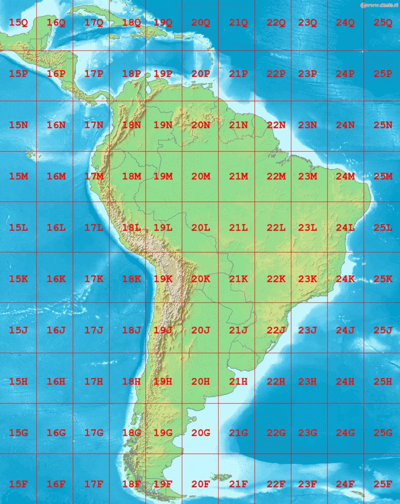
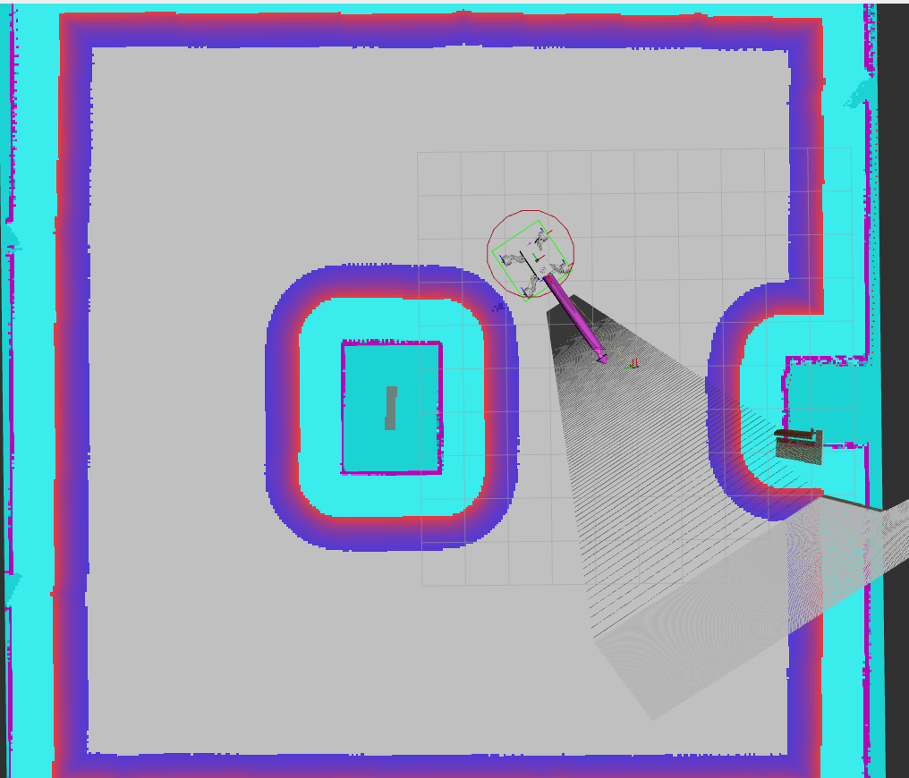
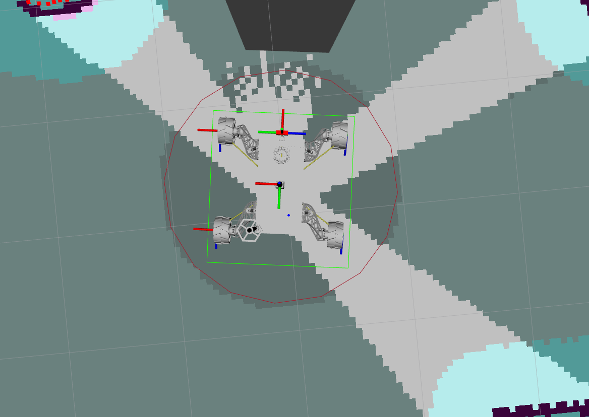

# Trailblazer nav2
Paczka trailblazer_nav2 odpowiada za autonomiczną nawigację robota Trailblazer z wykorzystaniem systemu Nav2 w ROS 2.
Zawiera konfigurację lokalizacji, nawigacji. Jej celem jest umożliwienie robotowi samodzielnego przemieszczania się po znanym terenie oraz łatwe dostosowanie ustawień do własnych map i tras.

TODO:
- [ ] Dodać gotowe przykłady mapy (maps/)
- [ ] Opisać jak dodać własne punkty GPS do jazdy

## 📚 Spis treści

- [📁 Struktura katalogów](#-struktura-katalogów)
- [🗺️ GPS i GNNS](#-gps-i-gnss)
    - [❔ Co to jest GPS/GNSS?](#-co-to-jest-gpsgnss)
    - [❔ Co to UTM?](#-co-to-utm)
- [🧭 Lokalizacja robota](#-lokalizacja-robota)
    - [📦 Konfiguracja lokalizacji](#-konfiguracja-lokalizacji)
- [🚗 Autonomiczna jazda](#-autonomiczna-jazda)
    - [⚙️ Dostosowanie ustawień AMCL](#️-dostosowanie-ustawień-amcl)
    - [⚙️ Dostosowanie ustawień bt_navigator](#️-dostosowanie-ustawień-bt_navigator)
    - [⚙️ Dostosowanie ustawień controller_server](#️-dostosowanie-ustawień-controller_server)
    - [⚙️ Dostosowanie ustawień local_costmap](#️-dostosowanie-ustawień-local_costmap)
    - [⚙️ Dostosowanie ustawień global_costmap](#️-dostosowanie-ustawień-global_costmap)
    - [⚙️ Dostosowanie ustawień map_server](#️-dostosowanie-ustawień-map_server)
    - [⚙️ Dostosowanie ustawień behavior_server](#️-dostosowanie-ustawień-behavior_server)
- [👣 Co to base footprint?](#-co-to-base-footprint?)
- [📍 Mapviz - wizualizacja map](#-mapviz---wizualizacja-map)
  - [🌍 MapViz i Google Maps](#-mapviz-i-google-maps)
  - [🎯 GPS Waypoint Follower](#-gps-waypoint-follower)
- [🛠️ Jak używać](#️-jak-używać)
- [🔗 Linki](#-linki)

## 📁 Struktura katalogów
    src/trailblazer_nav2
    ├── config              # Pliki konfiguracyjne
    ├── launch              # Pliki startowe
    ├── maps                # Mapy
    ├── package.xml         # Zależności, opis, wersja
    ├── setup.py            # Plik instalacyjny
    └── trailblazer_nav2    # Moduł paczki

## 🗺️ GPS i GNNS
### ❔ Co to jest GPS/GNSS?
GPS/GNSS to systemy, które używają satelit, by określić Twoje położenie (szerokość, długość i wysokość geograficzną).Standardowo pozycję podaje się w układzie ***WGS84*** – to taki "globalny" system XYZ, którego środek jest w środku Ziemi.
<div align="center">
  
</div>

Nawigowanie robota w takim systemie byłoby niewygodne — lepiej mówić mu "jedź 100 metrów na północ", a nie przesuwaj się o 0.001 stopnia szerokości geograficznej.

### ❔ Co to UTM?
Aby rozwiązać ten problem, używa się systemu UTM (Universal Transverse Mercator).
UTM dzieli Ziemię na strefy i tworzy lokalne układy współrzędnych w metrach, co znacznie ułatwia nawigację dla robotów bo zamiast globalnych współrzędnych mamy lokalne X i Y w metrach.
<div align="center">
  
</div>

## 🧭 Lokalizacja robota
Robot musi wiedzieć gdzie jest i w którą stronę patrzy. GPS daje tylko pozycję, ale nie orientację (czyli "w którą stronę przód robota jest skierowany"). Rozwiązaniem tego jest zastosowanie IMU (Inertial Measurement Unit), które mierzy przyspieszenia i obroty. W skrócie:
- GPS mówi „gdzie jestem?”,
- IMU mówi „w którą stronę jestem obrócony?”.

### 📦 Konfiguracja lokalizacji
Do dokładniejszego połączenia tych danych (IMU, enkodery i GPS) używamy `filtra EKF` (Extended Kalman Filter) oraz  rzetwarzaniu danych GNSS za pomocą `navsat_transform` z pakietu [robot_localization](https://docs.ros.org/en/melodic/api/robot_localization/html/index.html).

1) `navsat_transform_node` - Przelicza dane z GPS (dane geograficzne: długość/szerokość/ wysokość) na układ współrzędnych X, Y, Z 
2) `ekf_filter_node_odom` (mały EKF) - Łączy odometrię z IMU lokalnie, żeby mieć dokładne śledzenie ruchu robota w krótkiej skali (czyli bez użycia GPS)
3) `ekf_filter_node_map` (duży EKF) - Łączy wyniki małego EKF + pozycję GPS + IMU, żeby wiedzieć gdzie robot jest globalnie na mapie.

> [!NOTE]
> Poprawny łańcuch transformacji wygląda:
> 
> map (z ekf_filter_node_map) ➡️ odom (z ekf_filter_node_odom) ➡️ base_link

1) `ekf_filter_node_odom` oraz `ekf_filter_node_map`
```yaml
kf_filter_node_odom:
  ros__parameters:
    frequency: 30.0                     # Częstotliwość aktualizacji
    two_d_mode: true                    # Ignoruje ruch w osi "Z" 2D tryb (dla robotów po ziemi)
    print_diagnostics: false            # Wypisywanie informagi diagnostycznych np. WARNING
    debug: false                        # Możliwość tworzenia plików log
    publish_tf: true                    # Publikuj transformację odom → base_link

    map_frame: map                      # Nazwa frame mapy
    odom_frame: odom                    # Nazwa frame odometrii
    base_link_frame: base_link          # Nazwa frame base_linku
    world_frame: odom                   # Nazwa frame świata lokalnego
```
Opis źródła danych do EKF definiuje się za pomocą listy w której kolejne wartości (bool) odpowiadają za:

    [   x_pos   , y_pos    , z_pos,
        roll    , pitch    , yaw,
        x_vel   , y_vel    , z_vel,
        roll_vel, pitch_vel, yaw_vel,
        x_accel , y_accel  , z_accel    ]

```yaml
odom0_queue_size: 10                            # Kolejka wiadomości oczekujących na przetworzenie
odom0_differential: false                       # Nie traktuj odometrii jako różnicowej tylko jako absolutne pomiary
odom0_relative: false                           # Nie przekształcaj danych na relatywne

imu0_differential: true                         # Czyli traktujesz zmianę kąta yaw jako delta (dobre dla tanich IMU)
imu0_relative: false                            # Dane nie są przekształcane na względne
imu0_queue_size: 10
imu0_remove_gravitational_acceleration: true    # Usuwa wpływ grawitacji z pomiarów przyspieszenia (normalne dla IMU)

use_control: false                              # Nie używa żadnych danych o sterowaniu
process_noise_covariance: [...]                 # Macierz określająca jak bardzo EKF ufa swoim przewidywaniom
```

2) `navsat_transform`
```yaml
navsat_transform:
  ros__parameters:
    frequency: 30.0                     # Częstotliwość aktualizacji
    delay: 3.0                          # Opóźnienie działania w sekundach
    magnetic_declination_radians: 0.0   # Korekta na lokalną deklinację magnetyczną 
    yaw_offset: 0.0                     # Jeśli twoje "przód" GPS/IMU różni się od fizycznego przodu robota, można tu dodać korektę w radianach
    zero_altitude: true                 # Ignoruje wysokość (Z) z GPS 
    broadcast_utm_transform: true       # Publikuje transformację pomiędzy mapą (np. UTM) a lokalną mapą robota
    publish_filtered_gps: true          # Publikuje filtrowane dane GPS do odczytu.
    use_odometry_yaw: true              # Używa yaw (orientacji) z odometrii, a nie z GPS/IMU.
    wait_for_datum: false               # Nie czeka na manualne ustawienie punktu odniesienia, tylko automatycznie używa pierwszego GPS-a.
```


## 🚗 Autonomiczna jazda
Celem autonomicznej jazdy jest umożliwienie robotowi Trailblazer samodzielnego przemieszczania się po zaplanowanej trasie, bazując na punktach GPS lub na wyznaczonej ścieżce na mapie.

<div align="center">
  
</div>

### ⚙️ Dostosowanie ustawień AMCL
AMCL to algorytm lokalizacji robota na mapie.
```yaml
amcl:
  ros__parameters:
    base_frame_id: "base_link"
    global_frame_id: "map"
    odom_frame_id: "odom"
    scan_topic: scan
```

### ⚙️ Dostosowanie ustawień bt_navigator
BT Navigator zarządza misją robota przy użyciu tzw. Behavior Trees (BT) – drzew zachowań.
Dzięki temu robot wie np.:
- jak jechać do celu,
- jak unikać przeszkód,
- co robić gdy coś pójdzie nie tak.
```yaml
bt_navigator:
  ros__parameters:
    use_sim_time: True
    global_frame: map
    robot_base_frame: base_link
    odom_topic: /odom
```

### ⚙️ Dostosowanie ustawień controller_server
Controller Server odpowiada za sterowanie robotem w czasie rzeczywistym po zaplanowanej trasie.
```yaml
controller_server:
  ros__parameters:
    min_x_velocity_threshold: 0.2       # Minimalna dopuszczalna prędkość w osi X
    min_y_velocity_threshold: 0.2       # Minimalna dopuszczalna prędkość w osi Y
    min_theta_velocity_threshold: 0.2   # Minimalna dopuszczalna prędkość w osi obrotu
  progress_checker:
    required_movement_radius: 0.8       # Minimalne przesunięcie robota (w metrach) w określonym czasie
  general_goal_checker:
    xy_goal_tolerance: 0.6              # Tolerancja w XY (metry) kiedy uznajemy, że osiągnęliśmy cel
    yaw_goal_tolerance: 1.57            # Tolerancja kąta obrotu (radiany)
  FollowPath:
    min_vel_x: 0.0                      # Minimalna dopuszczalna prędkość robota w osi X
    max_vel_x: 0.7                      # Maksymalna prędkość jazdy robota w osi X m/s.
    max_vel_theta: 0.5                  # Maksymalne prędkość obrotu robota
    min_speed_xy: 0.1                   # Minimalna prędkość wypadkowa w płaszczyźnie XY
    max_speed_xy: 1.0                   # Maksymalna prędkość wypadkowa w płaszczyźnie XY
    min_speed_theta: 0.2                #	Minimalna prędkość obrotowa
    linear_granularity: 0.1             # Precyzja "kroków" w przestrzeni, im mniejsza wartość, tym dokładniejsze sterowanie
    angular_granularity: 0.1            # Precyzja "kroków" w przestrzeni obrotowej
    transform_tolerance: 0.2            # Tolerancja czasowa przy odczycie transformacji
    xy_goal_tolerance: 0.6              # Tolerancja osiągnięcia celu w XY (metry)
```

### ⚙️ Dostosowanie ustawień local_costmap
Local Costmap to lokalna mapa wokół robota, która jest dynamicznie aktualizowana podczas ruchu i służy do unikania przeszkód oraz krótkoterminowego planowania trajektorii.
```yaml
local_costmap:
  ros__parameters:
    width: 4                      # szerokość lokalnej mapy w metrach (Robot "widzi" przeszkody na 2 metry w każdą stronę)
    height: 4                     # wysokość lokalnej mapy w metrach (Robot "widzi" przeszkody na 2 metry w każdą stronę)
    inflation_layer:
      cost_scaling_factor:  2.58  # współczynnik spadku kosztu wokół przeszkód
      inflation_radius: 1.75      # promień inflacji wokół przeszkody w metrach
```

### ⚙️ Dostosowanie ustawień global_costmap
Global Costmap tworzy dużą mapę świata (lub jego znanej części), którą robot wykorzystuje do wyznaczania długoterminowych ścieżek.
```yaml
global_costmap:
  ros__parameters:
    inflation_layer:
      cost_scaling_factor: 2.58 # współczynnik spadku kosztu wokół przeszkód
      inflation_radius: 1.75    # promień inflacji wokół przeszkody w metrach
```

### ⚙️ Dostosowanie ustawień map_server
```yaml
map_server:
  ros__parameters:
    # TODO
```

### ⚙️ Dostosowanie ustawień behavior_server
```yaml
behavior_server:
  ros__parameters:
    # TODO
```

## 👣 Co to base footprint?
Base footprint to dwuwymiarowy (2D) obrys kształtu robota, rzutowany na płaszczyznę podłoża. W systemie nawigacji Nav2 w ROS 2, obrys ten służy głównie do detekcji kolizji podczas planowania tras i omijania przeszkód.
<div align="center">
  
</div>

```yaml
local_costmap:
  local_costmap:
    ros__parameters:
      robot_radius: 1.3
      footprint: "[[0.7, 0.65], [0.7, -0.65], [-0.7, -0.65], [-0.7, 0.65]]"

global_costmap:
  global_costmap:
    ros__parameters:
      robot_radius: 1.0
```

> [!NOTE]
> Jeśli w konfiguracji podamy oba parametry (`footprint` i `robot_radius`) Nav2 skorzysta z dokładniejszego kształtu wielokąta (footprint).

## 📍 Mapviz - wizualizacja map
Mapviz to narzędzie wizualizacyjne stworzone z myślą o wyświetlaniu danych 2D na dużą skalę — takich jak mapy, trajektorie, pozycje GPS, sensory lokalizacji i wszelkie dane związane z ruchem w przestrzeni płaskiej.
W przeciwieństwie do RViz, które obsługuje pełne 3D i dużą liczbę czujników, Mapviz skupia się wyłącznie na płaskiej powierzchni.

### 🌍 MapViz i Google Maps
MapViz posiada wtyczkę Tile_Map, która umożliwia wyświetlanie map kafelkowych (np. satelitarnych lub drogowych). Żeby w MapViz korzystać z danych z Google Maps (szczególnie tryb satelitarny), potrzebne jest pośrednictwo serwera kafelków, ponieważ Google Maps nie oferuje bezpośredniego dostępu do swoich warstw przez standardowy WMTS.

Rozwiązaniem jest MapProxy — serwer kafelków, który w tym przypadku działa jako pośrednik między Google Maps a MapViz. W naszym przypadku wystarczy że odpalimy poniższą komendę i uruchomimy kontener docker'a:

```bash
sudo docker run -p 8080:8080 -d -t -v ~/mapproxy:/mapproxy danielsnider/mapproxy
```

Następnie w samym MapViz wystarczy że w wtyczce `Tile_Map` z dostępnych opcji wybierzemy `Custom WMTS Sourcze` i dodamy poniższy URL:

```
http://localhost:8080/wmts/gm_layer/gm_grid/{level}/{x}/{y}.png
```

### 🎯 GPS Waypoint Follower
Interactive GPS Waypoint Follower to rozszerzenie funkcjonalności nawigacji robota na podstawie waypointów (punktów GPS) ustawianych interaktywnie na mapie w Mapviz. Nav2 dostarcza nam dwie opcje wyznaczania waypointów:
- Interactive GPS Waypoint Follower - ręczne dodawanie punktu klikając w interfejsie MapViz
- Logged GPS Waypoint Follower - punkty są zczytywane zpliku `yaml`


## 🛠️ Jak używać
### ✅ Zbudowanie paczki
```bash
cd ~/TrailblazerML
colcon build --packages-select trailblazer_nav2
source install/setup.bash
```
### 🚀 Uruchomienie symulacji samodzielnie
```bash

```

### 🧩 Integracja z innymi paczkami
```python

```

### Usefull command
```bash
# testowanie navsat
ros2 launch trailblazer_nav2 dual_ekf_navsat.launch.py 

## podaj początkowe współrzędne
ros2 topic pub --rate 10 /gps/fix sensor_msgs/NavSatFix "{                                                               header: { stamp: { sec: $(date +%s), nanosec: 0 }, frame_id: 'base_link' },
  latitude: 0.0411,
  longitude: 0.0001,
  altitude: 0.0,
  status: { status: 1, service: 1 }
}"
## następna komenda oblicza ile punktów do docelowego miejsca
ros2 service call /fromLL robot_localization/srv/FromLL "{ll_point: {latitude: 50.0411, longitude: 22.0001, altitude: 0.0}}"

```

## 🔗 Linki
- https://docs.nav2.org/tutorials/docs/navigation2_with_gps.html
- https://github.com/ros-navigation/navigation2_tutorials/tree/rolling/nav2_gps_waypoint_follower_demo
- https://docs.nav2.org/tutorials/docs/navigation2_dynamic_point_following.html
- https://docs.nav2.org/setup_guides/footprint/setup_footprint.html
- https://automaticaddison.com/ros-2-navigation-tuning-guide-nav2/#local_costmap
- https://docs.nav2.org/configuration/packages/configuring-costmaps.html#plugin-parameters
- https://www.geoportal.gov.pl/pl/usluga/uslugi-przegladania-wms-i-wmts/
- https://roboticsknowledgebase.com/wiki/tools/mapviz/
- https://github.com/danielsnider/MapViz-Tile-Map-Google-Maps-Satellite
- https://github.com/ros-navigation/navigation2_tutorials/issues/77
